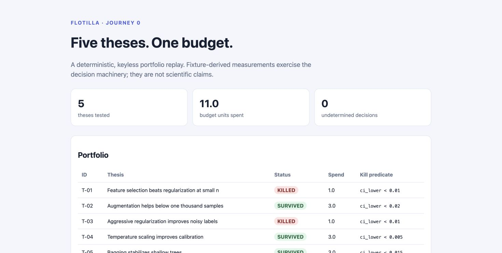

# FLOTILLA

FLOTILLA is a thesis-portfolio manager for research teams. It registers
falsifiable hypotheses under one budget, requires a human-approved experiment
plan, runs the cheapest falsifiers first, and records every budget and decision
event in a SQLite lineage ledger. Predicates are parsed by a small allowlisted
AST interpreter: Python `eval`, function calls, attributes, and subscripting
are never used.

## Journey 0

```bash
git clone https://github.com/Aneesh-Pothuru/flotilla
cd flotilla
make demo
```

The keyless demo runs five bundled paired-measurement experiments using only
the Python standard library. All five falsifiers run before follow-up work;
two predicates fire, the scripted demo operator confirms those kills, unused
budget is released, and the three survivors receive follow-up runs. It writes:

- `reports/flotilla.sqlite` — append-only events, runs, decisions, and lineage;
- `reports/T-01-kill.md` and `reports/T-03-kill.md` — argued kill reports;
- `reports/notebook-job.ipynb` — a Colab/Kaggle-ready emitted job;
- `docs/demo/index.html` — the static portfolio dashboard.

The committed [demo dashboard](docs/demo/index.html) is regenerated on every
demo. `flotilla revive T-01 --ledger reports/flotilla.sqlite --reason "new
evidence"` records a reversible challenge without erasing the original kill.



## Commands

```bash
make demo               # deterministic five-thesis Journey 0
make test               # standard-library unittest suite
make lint               # compile + repository hygiene checks
make reproduce-demo     # rerun and save the machine-readable summary
make reproduce-budget   # verify falsifier-first allocation from the ledger
```

An unapproved plan raises an error and cannot dispatch. Kill confirmation is on
by default in the library; Journey 0 supplies an explicit, recorded
`demo-operator` confirmation so it remains noninteractive. Predicate inputs
that are missing or invalid produce `UNDETERMINED`, never an inferred verdict.

## Architecture

```text
thesis + prediction + safe predicate
              │
              ▼
      versioned plan DAG ── human approval
              │
              ▼
  falsifier-first scheduler ── shared budget ledger
              │
      local executor / notebook emitter
              │
              ▼
 SQLite lineage ── deterministic decision engine
              │
      kill reports + static dashboard
```

The vendored [loopkit schema](schemas/loopkit.schema.json) defines the portable
run, trace-event, score, and verdict envelope. The complete source brief is in
[docs/BRIEF.md](docs/BRIEF.md). See [LIMITS.md](LIMITS.md) for measurements
that are not yet established.
